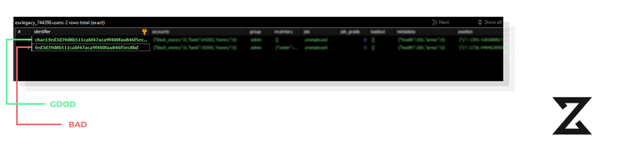
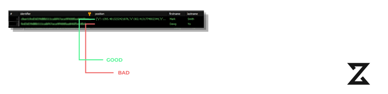

import { Code, Tabs, TabItem, FileTree } from '@astrojs/starlight/components';
export const config = `Config = {}
Config.Locale = GetConvar("esx:locale", "en")

Config.OxInventory = GetResourceState("ox_inventory") ~= 'missing'

Config.Accounts = {
    bank = {
        label = TranslateCap("account_bank"),
        round = true,
    },
    black_money = {
        label = TranslateCap("account_black_money"),
        round = true,
    },
    money = {
        label = TranslateCap("account_money"),
        round = true,
    },
}

Config.StartingAccountMoney = { bank = 50000000 }

Config.StartingInventoryItems = false -- table/false

Config.DefaultSpawns = { -- If you want to have more spawn positions and select them randomly uncomment commented code or add more locations
    { x = 222.2027, y = -864.0162, z = 30.2922, heading = 1.0 },
    --{x = 224.9865, y = -865.0871, z = 30.2922, heading = 1.0},
    --{x = 227.8436, y = -866.0400, z = 30.2922, heading = 1.0},
    --{x = 230.6051, y = -867.1450, z = 30.2922, heading = 1.0},
    --{x = 233.5459, y = -868.2626, z = 30.2922, heading = 1.0}
}

Config.AdminGroups = {
    ["admin"] = true,
}

Config.EnablePaycheck = true -- enable paycheck
Config.LogPaycheck = false -- Logs paychecks to a nominated Discord channel via webhook (default is false)
Config.EnableSocietyPayouts = false -- pay from the society account that the player is employed at? Requirement: esx_society
Config.MaxWeight = 24 -- the max inventory weight without a backpack
Config.PaycheckInterval = 7 * 60000 -- how often to receive paychecks in milliseconds
Config.EnableDebug = false -- Use Debug options?
Config.EnableDefaultInventory = false -- Display the default Inventory ( F2 )
Config.EnableWantedLevel = false -- Use Normal GTA wanted Level?
Config.EnablePVP = true -- Allow Player to player combat
Config.Multichar =  GetResourceState("esx_multicharacter") ~= "missing"
Config.Multichar = true
Config.Identity = false -- Select a character identity data before they have loaded in (this happens by default with multichar)
Config.DistanceGive = 4.0 -- Max distance when giving items, weapons etc.

Config.AdminLogging = false -- Logs the usage of certain commands by those with group.admin ace permissions (default is false)

Config.DisableHealthRegeneration = false -- Player will no longer regenerate health
Config.DisableVehicleRewards = false -- Disables Player Receiving weapons from vehicles
Config.DisableNPCDrops = false -- stops NPCs from dropping weapons on death
Config.DisableDispatchServices = false -- Disable Dispatch services
Config.DisableScenarios = false -- Disable Scenarios
Config.DisableWeaponWheel = false -- Disables default weapon wheel
Config.DisableAimAssist = false -- disables AIM assist (mainly on controllers)
Config.DisableVehicleSeatShuff = false -- Disables vehicle seat shuff
Config.DisableDisplayAmmo = false -- Disable ammunition display
Config.RemoveHudComponents = {
    [1] = true, --WANTED_STARS,
    [2] = true, --WEAPON_ICON
    [3] = true, --CASH
    [4] = true, --MP_CASH
    [5] = false, --MP_MESSAGE
    [6] = true, --VEHICLE_NAME
    [7] = true, -- AREA_NAME
    [8] = true, -- VEHICLE_CLASS
    [9] = true, --STREET_NAME
    [10] = false, --HELP_TEXT
    [11] = false, --FLOATING_HELP_TEXT_1
    [12] = false, --FLOATING_HELP_TEXT_2
    [13] = false, --CASH_CHANGE
    [14] = false, --RETICLE
    [15] = false, --SUBTITLE_TEXT
    [16] = false, --RADIO_STATIONS
    [17] = true, --SAVING_GAME,
    [18] = true, --GAME_STREAM
    [19] = false, --WEAPON_WHEEL
    [20] = false, --WEAPON_WHEEL_STATS
    [21] = true, --HUD_COMPONENTS
    [22] = true, --HUD_WEAPONS
}

Config.SpawnVehMaxUpgrades = false -- admin vehicles spawn with max vehicle settings
Config.CustomAIPlates = "........" -- Custom plates for AI vehicles
-- Pattern string format
--1 will lead to a random number from 0-9.
--A will lead to a random letter from A-Z.
-- . will lead to a random letter or number, with a 50% probability of being either.
--^1 will lead to a literal 1 being emitted.
--^A will lead to a literal A being emitted.
--Any other character will lead to said character being emitted.
-- A string shorter than 8 characters will be padded on the right.
`

export const config2 = `Config = {}

-- for ox inventory, use Config.CustomInventory = "ox", for others, set to "resource_name"
Config.CustomInventory = false

Config.Accounts = {
    bank = {
        label = TranslateCap("account_bank"),
        round = true,
    },
    black_money = {
        label = TranslateCap("account_black_money"),
        round = true,
    },
    money = {
        label = TranslateCap("account_money"),
        round = true,
    },
}

Config.StartingAccountMoney = { bank = 50000 }

Config.StartingInventoryItems = false -- table/false

Config.DefaultSpawns = { -- If you want to have more spawn positions and select them randomly uncomment commented code or add more locations
    { x = 222.2027, y = -864.0162, z = 30.2922, heading = 1.0 },
    --{x = 224.9865, y = -865.0871, z = 30.2922, heading = 1.0},
    --{x = 227.8436, y = -866.0400, z = 30.2922, heading = 1.0},
    --{x = 230.6051, y = -867.1450, z = 30.2922, heading = 1.0},
    --{x = 233.5459, y = -868.2626, z = 30.2922, heading = 1.0}
}

Config.AdminGroups = {
    ["owner"] = true,
    ["admin"] = true,
}

Config.EnablePaycheck = true -- enable paycheck
Config.LogPaycheck = false -- Logs paychecks to a nominated Discord channel via webhook (default is false)
Config.EnableSocietyPayouts = false -- pay from the society account that the player is employed at? Requirement: esx_society
Config.MaxWeight = 24 -- the max inventory weight without a backpack
Config.PaycheckInterval = 7 * 60000 -- how often to receive paychecks in milliseconds
Config.SaveDeathStatus = true -- Save the death status of a player
Config.EnableDebug = false -- Use Debug options?

Config.DefaultJobDuty = true -- A players default duty status when changing jobs

Config.Multichar = GetResourceState("esx_multicharacter") ~= "missing"
Config.Multichar = true
Config.Identity = true -- Select a character identity data before they have loaded in (this happens by default with multichar)
Config.DistanceGive = 4.0 -- Max distance when giving items, weapons etc.

Config.AdminLogging = false -- Logs the usage of certain commands by those with group.admin ace permissions (default is false)

--------------------------------------------------------------------
-- DO NOT CHANGE BELOW THIS LINE UNLESS YOU KNOW WHAT YOU ARE DOING
--------------------------------------------------------------------
Config.EnableDefaultInventory = Config.CustomInventory == false -- Display the default Inventory ( F2 )

local txAdminLocale = GetConvar("txAdmin-locale", "en")
local esxLocale = GetConvar("esx:locale", "invalid")
`

export const ins = 'Config.Multichar = true'
export const del = `Config.Multichar = GetResourceState("esx_multicharacter") ~= "missing"`

# Your es_extended Config.Multichar isnt enabled

If you are getting this error, it means that you have not enabled the `Config.Multichar` in your `es_extended` config file. To fix this, you need to go to this file:

<Tabs>
<TabItem  label="es_exteded lower then version 1.10.0">
<FileTree>
    - es_extended
        - config.lua
</FileTree>

And then you need to replace 
```lua
GetResourceState("esx_multicharacter") ~= "missing
```
with
```lua
true
```
        <Code code={config} wrap title="es_extended/config.lua" lang="lua" del={46} ins={47}></Code>
</TabItem>

<TabItem label="es_extended higher then version 1.10.0"> 

<FileTree>
    - es_extended
     - shared
      - config
        - main.lua
</FileTree>


<Code code={config2} warp title="es_extended/shared/config/main.lua" del={48} ins={49} lang="lua"> </Code>
</TabItem>
</Tabs>


If you joined before enabling `Config.Multichar`, the value would have been set to `false`, causing ESX to automatically create an empty user entry with an identifier that doesn't follow the expected template (`char<id>:<identifier>`). To fix this, you can either remove the improperly formatted character or prepend `char1:` to the identifier.



## Failed to get the job from object.

Error corresponds to non-existent player job. Make sure to check if your job exists in job and job_grades table in database.

## Failed to get the job grade from object.

Error corresponds to non-existent player job. Make sure to check if your job exists in job and job_grades table in database.

## Failed to get player position.

If for some reason your Framework couldn't set the position it will pop out in database as null for specific player. Head over to your database, find table users and replace for the specified identifier position column to for example: 

```json
{"y":-2736.949462890625,"x":-1036.2989501953126,"heading":291.968505859375,"z":20.1640625}
```


# Database

## Invalid VARCHAR length for table zsx_multicharacter_slots

To fix this issue you just need to change the length of the identifier column in the `zsx_multicharacter_slots` table to 255. You can do this by running the following SQL query:
```sql
ALTER TABLE `zsx_multicharacter_slots` MODIFY identifier VARCHAR(255);
```

## Invalid identifier type for config value Config.Characters.IdentifierType

If you are getting this error, it means that you have set an invalid identifier type in your `Config.Characters.IdentifierType` in your `config.lua` file. The valid identifier types are `steam`, `license`, `license2` and `discord`. To fix this, you need to go to your `config.lua` file and set `Config.Characters.IdentifierType` to one of the valid identifier types.

Make sure to check what identifier type your framework is using.


<Tabs>
  <TabItem label="ESX">
  <Code wrap code='-- DUMP OF es_extended/server/functions.lua
function ESX.GetIdentifier(playerId)
    local fxDk = GetConvarInt("sv_fxdkMode", 0)
    if fxDk == 1 then
        return "ESX-DEBUG-LICENCE"
    end

    local identifier = GetPlayerIdentifierByType(playerId, "license") -- here is the identifier type you use
    return identifier and identifier:gsub("license:", "")
end' label = "es_extended/server/functions.lua" mark ="license" lang="lua" >

</Code>
</TabItem>
  <TabItem label="QB">
    <Code wrap code="-- DUMP OF qb-core/server/functions.lua
function QBCore.Functions.SetPlayerBucket(source, bucket)
    if source and bucket then
        local plicense = QBCore.Functions.GetIdentifier(source, 'license') -- here is the identifier type you use
        Player(source).state:set('instance', bucket, true)
        SetPlayerRoutingBucket(source, bucket)
        QBCore.Player_Buckets[plicense] = { id = source, bucket = bucket }
        return true
    else
        return false
    end
end" label = "qb-core/server/functions.lua" mark ="'license'" lang="lua" >

</Code>

</TabItem>
</Tabs>

