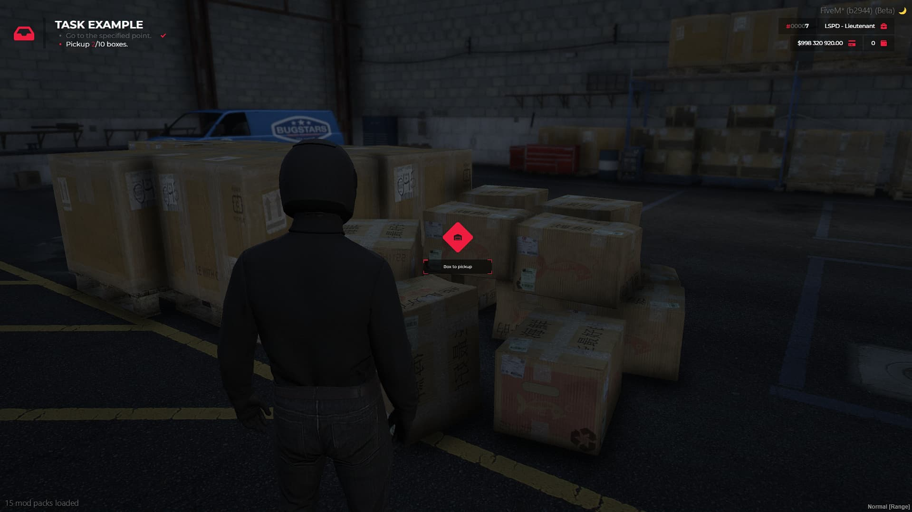

import { Aside, Tabs, TabItem, LinkCard, CardGrid } from '@astrojs/starlight/components';
import YouTubeGrid from '../../../components/youtube-grid.astro';

<YouTubeGrid
	videos={[
		{
			href: 'https://youtu.be/s7HqJ5-_Pmo',
		},
	]}
/>

<CardGrid>
  <LinkCard title="Tebex Store" href="https://store.zeusx.dev/package/6586198">
  </LinkCard>
  <LinkCard title="CFX Forum Post" href="https://forum.cfx.re/t/paid-zsx-user-interface-v2-the-most-powerful-ui-kit-zsx-uiv2/5298796">
  </LinkCard>
</CardGrid>

## What is ZSX-UI V2?

ZSX-UI V2 is more than just a UI; it's a powerful, customizable kit designed for FiveM servers. It eliminates the need for additional resources, offering a seamless experience with an integrated design system for your server. Perfect for creating a consistent user interface across your server, it enables you to craft a dynamic and immersive gameplay experience.

---

### What’s New in ZSX-UI V2?

The new version of ZSX-UI V2 is packed with fresh ideas and next-generation features, optimizing your server’s UI to deliver a better user experience. Here’s a look at what’s new:

- **Optimized for Future Integrations**: The entire interface is prepared to work with upcoming assets, ensuring long-term compatibility.
- **Cinematic Enhancements**: Subtle cinematic touches inspired by our Multicharacter system, adding depth to the gameplay without overshadowing core mechanics.
  
### Design Overhaul

We redesigned key components of the UI to create a cleaner, more cohesive design. Here’s a quick overview of the changes:

- **Configuration Screen**: A revamped design to better suit the UI system.

### Minimalism

We believe in simplicity, which is why ZSX-UI V2 follows a minimalistic approach. Unused components are removed dynamically, reducing on-screen clutter and letting players focus on gameplay. However, customization is at the core, and each player can adjust the UI to their liking (if allowed by the server).

### Job-Focused Components

ZSX-UI V2 introduces features designed to elevate roleplay experiences. These components include:

#### 3D Points

Points act as 3D waypoints, guiding players toward objectives. These points remain visible even when off-screen, improving navigation and keeping gameplay flowing smoothly.

#### Help Notifications

We’ve upgraded the notification system to support staged notifications, helping players track their progress through tasks. This ensures smoother gameplay and better task management.

---

### Chat System

A new chat system, fully customizable through the configuration file, is now part of ZSX-UI V2. You can easily modify or register new commands and manage chat functionality with ease.

---

### 3D Perspective

Take immersion to the next level with 3D content. The 3D HUD!

#### Weapon Indicator

Incorporating the 3D perspective, we introduced a **Weapon Indicator** that allows players to check ammo counts while aiming.

---

### TextUI

With ZSX-UI V2, the **TextUI system** enables dynamic interaction options.

---

### 3D ME & DO System

We’ve designed a subtle interface that brings key in-game interactions, such as "/me" and "/do" commands, into the 3D environment.

---

### Pause Menu

The **Pause Menu** is fully dynamic, looking different each time it's accessed for a fresh experience. Custom buttons can be added for further personalization.

---

### Minimap Overhaul

We gave the **Minimap** a much-needed upgrade! Now with street labels and animated components, it provides an even more streamlined, interactive navigation experience.

##### Minimap Fade Animation:

postal codes can be added to the street label for further customization!

---
